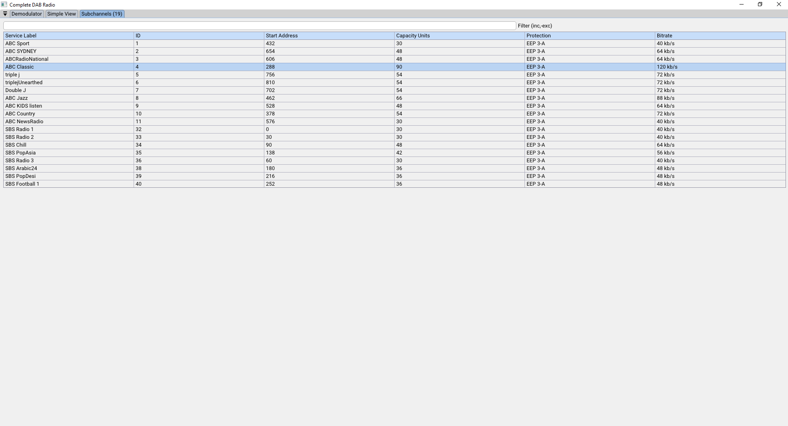

# Introduction
An implementation of a DAB (digital audio broadcasting) radio using software defined radio. 

This repository contains applications that:
1. Demodulate the OFDM (orthogonal frequency division multiplexed) raw IQ signals into a digital frame
2. Decode DAB digital OFDM frames for use into a radio application

The code in this project is purely academic. It can be considerably improved and optimised. Examples of more polished DAB projects is listed in the inspirations section below.

## Gallery

## How to run
### Method 1
Download the ZIP archive from the releases page. 
Use git-bash or a shell that supports redirecting stdout. 

Run <code>./get_live_data.sh -c [your_dab_channel] | ./basic_radio_app.exe</code>

Refer to the code inside <code>./get_live_data.sh</code> for the list of possible frequency blocks where your DAB ensemble exists in.

[Wohnort](http://www.wohnort.org/dab/australia.html) has an excellent website for viewing the list of DAB ensembles across the work. In Australia where I am, the blocks being used in Sydney are <code>[9A,9B,9C]</code>.

If you can't find any DAB ensembles in your area, then you can download binary files from the Releases page. These contain raw IQ values as well as pre-demodulated OFDM digital frames. You can read in these files with the applications described in the application list.

### Method 2
Clone the repository and build the applications using cmake. NOTE that the application was written for Windows and will not work with other platforms.

But the core algorithms are platform independent. You just need to write code to support other platforms. This includes the imgui GUI code, and the 16bit PCM audio player.

## Application list
| Name | Description |
| --- | --- |
| bin/rtl_sdr | Reads raw 8bit IQ values from your rtl-sdr dongle to stdout |
| basic_radio_app | Reads raw 8bit IQ stream and demodulates and decodes it for a basic radio |
| basic_radio_app_no_demod | Reads in a digital OFDM frame from ofdm_demod_gui or ofdm_demod_cli and decodes it for a basic radio |
| ofdm_demod_cli | Demodulates a raw 8bit IQ stream into digital OFDM frames |
| ofdm_demod_gui | Demodulates a raw 8bit IQ stream into digital OFDM frames with a GUI |
| simulate_transmitter | Simulates a OFDM signal with a defined transmission mode, but doesn't contain any meaningful digital data. Outputs an 8bit IQ stream to stdout. |

## TODO
### Optimisations
- Make OFDM demodulator more performant
    - Replace use of cosf and sinf in phase locked loop for fine freq compensation
    - Reduce overhead due to complex multiplication
- Make DAB frame decoder more performant
    - Replace inefficient general viterbi decoder with the SPIRAL project's implementation found [here](https://www.spiral.net/software/viterbi.html). 
- Profile other parts of the code that are excessively slow

### Features
- Improve the basic radio GUI
- Replace imgui with a less GPU/CPU hungry GUI framework
- Integrate the rtl_sdr.exe code from the librtlsdr library 
    - Add in ensemble scanning across possible block frequencies
    - Add support for basic radio to handle multiple ensembles
    - Persist DAB database on the hard disk
- Support the rest of the DAB standard
    - MPEG-II audio
    - Stream/packet data for slideshows and extra programme information

### Documentation
- Add as much comments to link specific pieces of code to parts of the standard that were heavily referenced. This includes the specific document number, the specific clause and specific table/chart used.

## Inspirations
- The welle.io open source radio has an excellent implementation of DAB radio. Their implementation is much more featureful and optimised than mine. Their repository can be found [here](https://github.com/albrechtl/welle.io). They also have a youtube video showcasing their wonderful software [here](https://www.youtube.com/watch?v=IJcgdmud-AI). 

- There is a large community of rtl-sdr projects which can be found at [rtl-sdr.com](https://www.rtl-sdr.com/tag/dab/). This link points to a webpage showcasing several open source community projects that aim to decode DAB signals.

- [ETSI](https://www.etsi.org/standards) the non-for-profit standardisation organisation for making all of the standards free to access and view. Without their detailed documentation and specifications it would not be possible to build a rtl-sdr DAB radio.