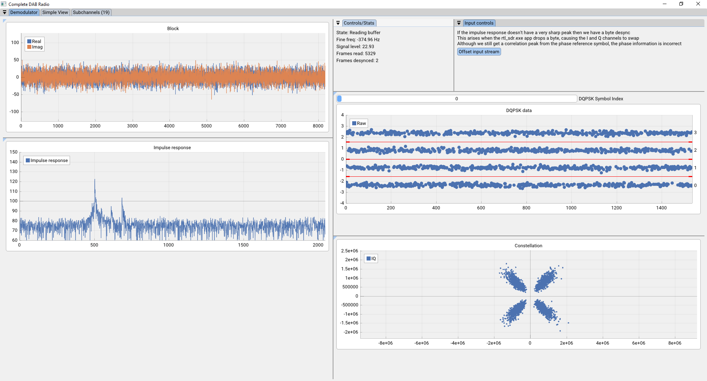
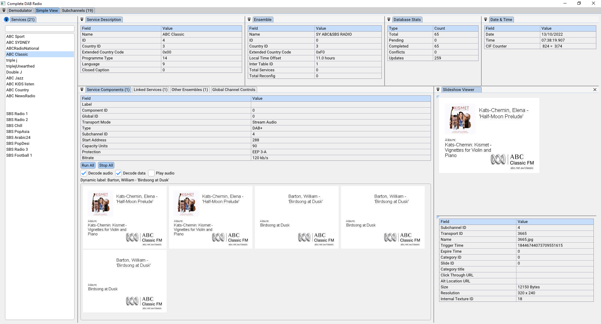

# Introduction
An implementation of a DAB (digital audio broadcasting) radio using software defined radio. 

For a description of what software defined radio is refer to this [link](https://www.rtl-sdr.com/about-rtl-sdr/). 

This repository contains applications that:
1. Demodulate the OFDM (orthogonal frequency division multiplexed) raw IQ signals into a digital frame
2. Decode DAB digital OFDM frames for use into a radio application

The code in this project is purely academic. It can be considerably improved and optimised. Examples of more polished DAB projects is listed in the inspirations section below.

For those who are interested only in parts of the implementation refer to the following directories:

| Directory | Description |
| --- | --- |
| src/modules/ofdm | OFDM demodulation code |
| src/modules/dab  | DAB digital decoding core algorithms |
| src/modules/basic_radio | Combines all of the DAB core algorithms into a cohesive example app |
| src/modules/basic_scraper | Attaches itself via callbacks to a basic_radio instance to save audio/slideshow/MOT data to disk |
| src/utility | Small helper template library for general purpose use |
| src/audio   | Audio player library for playing through sound device |
| src/gui     | ImGui code for application user interface |
| src/*.cpp   | All our sample applications |

## Gallery

## How to run
### Method 1
Download the ZIP archive from the releases page. 

Run <code>./radio_app.exe</code>

Go to the simple_view tab and select a service from the list. Click "Run All" to listen to the channel and receive slideshows.

[Wohnort](http://www.wohnort.org/dab/australia.html) has an excellent website for viewing the list of DAB ensembles across the work. In Australia where I am, the blocks being used in Sydney are <code>[9A,9B,9C]</code>.

If you can't find any DAB ensembles in your area, then you can download binary files from the Releases page. These contain raw IQ values as well as pre-demodulated OFDM digital frames. You can read in these files with the applications described in the application list.

### Method 2
Clone the repository using the command

<code>git clone https://github.com/FiendChain/DAB-Radio.git --recurse-submodules -j8</code>

#### 1. Windows (cmd)
Install Visual Studio 2022 and install the C++ developer kit.

Install [vcpkg](https://vcpkg.io/en/getting-started.html)

<code>fx cmake-conf</code>

<code>fx build release build\ALL_BUILD.vcxproj</code>

***NOTE***: Modify the fx.bat helper batch file to point at your vcpkg install directory. 

#### 2. Ubuntu 22.04
<code>./install_ubuntu_packages.sh</code>

<code>cmake . -B build -G Ninja -DCMAKE_BUILD_TYPE=Release</code>

<code>ninja -C build -j8</code>

#### Build notes
The core algorithms for OFDM demodulation and DAB digital decoding are platform independent. The GUI code uses imgui which works on Windows and Ubuntu. 

AVX2 and SSE4 instructions are used to speed up OFDM demodulation dsp and the viterbi decoder. You can change the compiler options in CMakeLists.txt to disable AVX2 or SSE4 if your cpu or compiler doesn't support it. If you are building this on other platforms other changes may need to be made.

Built on Windows 10 with:
- msbuild 17.2.1 + 52cd2da31
- cl 19.32.31332 for x64
- Visual Studio 2022 Community Edition (Which installs msbuild, cl and cmake)

Dependencies are (refer to vcpkg.json or install_ubuntu_packages.sh):
- glfw3
- opengl
- portaudio
- fftw3

The continuous integration (CI) scripts are in .github/workflows if you want to replicate the build on your system.

## Application list
| Name | Description |
| --- | --- |
| **radio_app** | **The complete radio app with controls for the tuner** |
| bin/rtl_sdr | Reads raw 8bit IQ values from your rtl-sdr dongle to stdout |
| basic_radio_app | Complete app that reads raw 8bit IQ stream and demodulates and decodes it into a basic radio |
| basic_radio_app_no_demod | Reads in a digital OFDM frame from ofdm_demod_gui or ofdm_demod_cli and decodes it for a basic radio |
| ofdm_demod_cli | Demodulates a raw 8bit IQ stream into digital OFDM frames |
| ofdm_demod_gui | Demodulates a raw 8bit IQ stream into digital OFDM frames with a GUI |
| convert_viterbi | Decodes/encodes between a viterbi_bit_t array of soft decision bits to a packed byte |
| basic_radio_scraper | Reads raw 8bit IQ stream, demodulates and decodes the data, then saves it to disk |
| basic_radio_scraper_no_demod | Reads in a digital OFDM frame from ofdm_demod_gui or ofdm_demod_cli, decodes the data then saves it to disk |
| simulate_transmitter | Simulates a OFDM signal with a defined transmission mode, but doesn't contain any meaningful digital data. Outputs an 8bit IQ stream to stdout. |
| apply_frequency_shift | Applies a frequency shift to a 8bit IQ stream |
| read_wav | Reads in a wav file which can be 8bit or 16bit PCM and dumps raw data to output as 8bit |

## Example usage scenarios (using git-bash on Windows)
### 1. Run the complete radio app with rtlsdr tuner controls
<code>./radio_app.exe</code>

### 2. Run the radio app on a DAB ensemble while reading from rtl_sdr.exe

<code>./get_live_data.sh -c 9C | ./basic_radio_app.exe</code>

### 3. Run data scraper

<code>./get_live_data.sh -c 9C | ./basic_radio_scraper.exe -o ./data/9C_2/</code>

### 4. Run OFDM demod while saving undecoded OFDM frame bits

<code>./get_live_data.sh -c 9C | ./ofdm_demod_gui.exe > ./data/frame_bits_9C.bin</code>

### 5. Run OFDM demod while saving undecoded OFDM frame as packed bytes for 8x less space

<code>./get_live_data.sh -c 9C | ./ofdm_demod_gui.exe | ./convert_viterbi.exe > ./data/frame_bytes_9C.bin</code>

### 6. Unpack packed bytes into OFDM frame bits and run DAB radio app

<code>./convert_viterbi.exe -d -i ./data/frame_bytes_9C.bin | ./basic_radio_app_no_demod.exe</code>

**NOTE**: This is useful for testing changes to your DAB decoding implementation by replaying packed byte OFDM frames that you recorded previously. 

### 7. Play radio with GUI while storing OFDM frames as packed bytes

<code>./get_live_data.sh -c 9C | ./ofdm_demod_gui.exe | ./convert_viterbi.exe | tee data/frame_bytes_9C.bin | ./convert_viterbi.exe -d | ./basic_radio_app_no_demod.exe</code>

**NOTE**: <code>tee</code> is a unix application that reads in stdin and outputs to stdout and the specified filepath.

### 8. Run data scraper with OFDM demodulator GUI while storing OFDM frames as packed bytes

<code>./get_live_data.sh -c 9C | ./ofdm_demod_gui.exe | ./convert_viterbi.exe | tee data/frame_bytes_9C.bin | ./convert_viterbi.exe -d | ./basic_radio_scraper_no_demod.exe</code>

## TODO
### Optimisations
- Make OFDM demodulator more performant
    - ~~Replace use of cosf and sinf in phase locked loop for fine freq compensation~~
    - ~~Added multithreading to improve performance~~
    - ~~Speed up complex multiplication with manual vectorization~~
    - ~~Replaced atan2f with L1 norm and component extraction~~
- ~~Make DAB frame decoder more performant~~
    - ~~Replace inefficient general viterbi decoder with the SPIRAL project's implementation found [here](https://www.spiral.net/software/viterbi.html).~~
- Profile other parts of the code that are excessively slow
- Error correction
    - ~~Use soft decision Viterbi decoding to improve error correction at low SNR~~
    - ~~Increase the traceback length of the Viterbi decoder (Not preferrable due to currently slow implementation)~~
    - Determine how to use the firecode CRC16 in the AAC super frame to correct errors

### Features
- Improve the basic radio GUI
    - Make a user friendly interface that is streamlined
    - Replace imgui with a less GPU/CPU hungry GUI framework
- ~~Integrate the rtl_sdr.exe code from the librtlsdr library~~
    - ~~Add in ensemble scanning across possible block frequencies~~
    - ~~Add support for basic radio to handle multiple ensembles~~
    - Automatically scan ensembles and persist data
- Support the rest of the DAB standard
    - MPEG-II audio for DAB channels
    - ~~Stream/packet data for slideshows and extra programme information~~
    - Handle strings with utf-8, utf-16 character sets (right now they show up as a question mark)
- ~~Add coarse frequency correction~~
- Add TII (transmitter identificaton information) decoding
- Add SNR meter
- Add view for OFDM symbol magnitude spectrum
- Persist DAB database on the hard disk
    - Save as JSON 
    - Load from JSON at runtime if specified

### Documentation
- Add as much comments to link specific pieces of code to parts of the standard that were heavily referenced. This includes the specific document number, the specific clause and specific table/chart used.

### Compliance
- ~~Conform to rule of 0/3/5 by using stl containers~~
- ~~Delete move/copy constructors for objects which rely on callbacks that take in pointers~~
- ~~Use smart pointers to manage memory instead of manually managing memory~~
- Fix up parts of the codebase which may have security vulnerabilities due to improper bounds checking, etc... there are a lot of possibilities

## Inspirations
- The welle.io open source radio has an excellent implementation of DAB radio. Their implementation is much more featureful and optimised than mine. Their repository can be found [here](https://github.com/albrechtl/welle.io). They also have a youtube video showcasing their wonderful software [here](https://www.youtube.com/watch?v=IJcgdmud-AI). 

- There is a large community of rtl-sdr projects which can be found at [rtl-sdr.com](https://www.rtl-sdr.com/tag/dab/). This link points to a webpage showcasing several open source community projects that aim to decode DAB signals.

## Important sources
- [ETSI](https://www.etsi.org/standards) the non-for-profit standardisation organisation for making all of the standards free to access and view. Without their detailed documentation and specifications it would not be possible to build a rtl-sdr DAB radio.
- [Phil Karn](https://github.com/ka9q) for his Reed Solomon and Viterbi decoding algorithms which can be found [here](https://github.com/ka9q/libfec)
- [tcbrindle](https://github.com/tcbrindle) for his C++ single header template library implementation of std::span which can be found [here](https://github.com/tcbrindle/span)
- [reyoung/avx_mathfun](https://github.com/reyoung/avx_mathfun) for their AVX/AVX2 implementations of _mm512_cos_pd
- [RJVB/sse_mathfun](https://github.com/RJVB/sse_mathfun) for their SSE2 implementations of _mm_cos_pd
